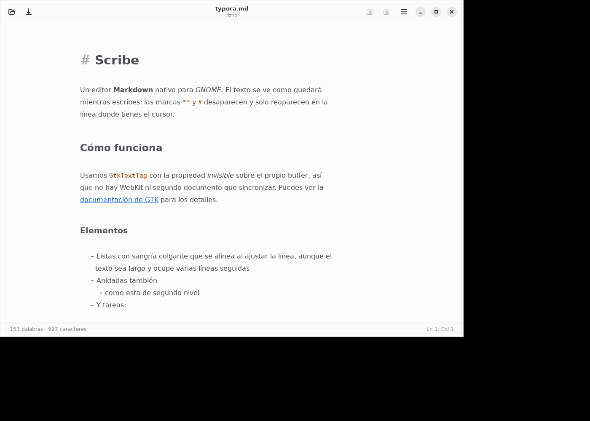
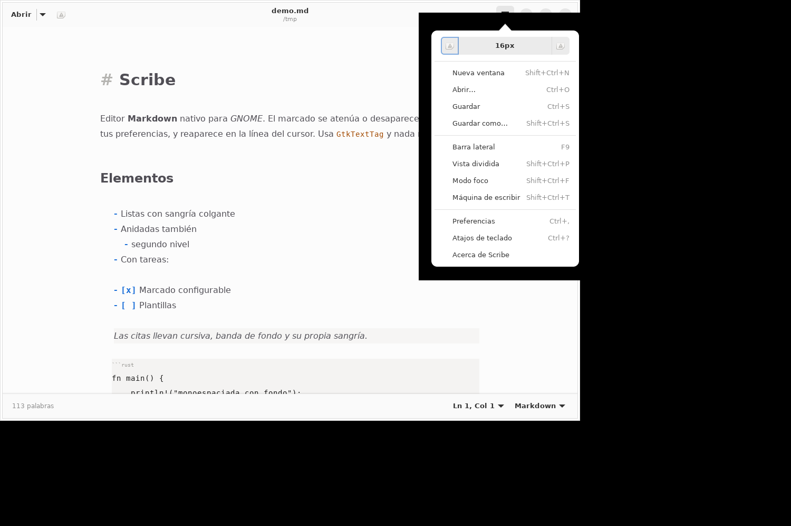
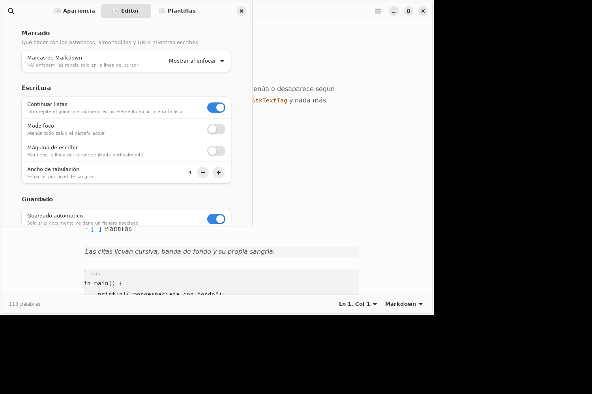
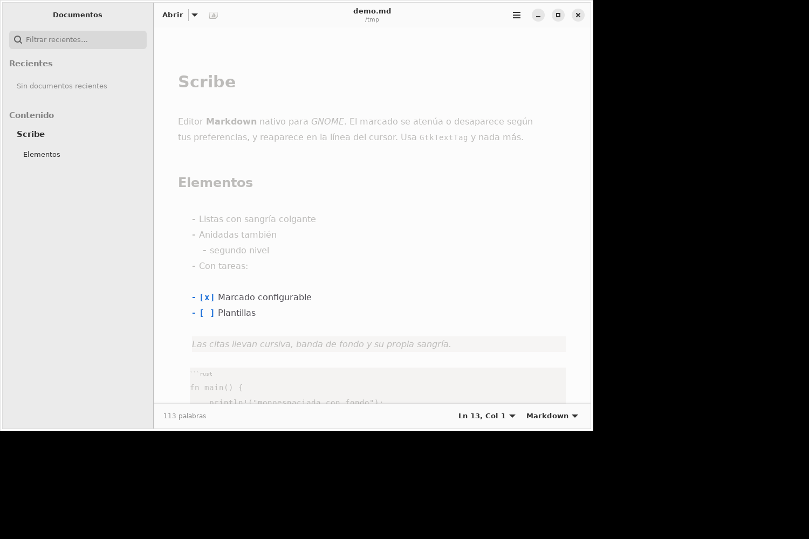

# Scribe

<p align="center">
  <a href="README.es.md">Español</a> |
  <a href="README.md">English</a>
</p>

<p align="center">
  <a href="https://github.com/gnacho/scribe/releases"></a>
  <a href="LICENSE"></a>
</p>

<p align="center">
  <picture>
    <source media="(prefers-color-scheme: dark)" srcset="assets/hero-es-dark.png">
    <source media="(prefers-color-scheme: light)" srcset="assets/hero-es-light.png">
    
  </picture>
</p>

Scribe es un editor Markdown nativo para GNOME, escrito en Rust con GTK4 y
libadwaita. El Markdown se renderiza en vivo sobre el propio buffer de edición:
las cabeceras se ven con su tamaño, la negrita en negrita y las marcas de
sintaxis se atenúan o encogen, sin cambiar a una previsualización aparte ni
usar un motor de navegador.

## Por qué existe esto

Quería un editor Markdown que se sintiera parte de GNOME, no un porte de una
aplicación web. Los que probé o bien metían un motor de navegador (ProseMirror,
Milkdown dentro de WebKit) y consumían cientos de megabytes, o mostraban el
código fuente a un lado y la previsualización al otro. Acababa con los dos
paneles abiertos, yendo y viniendo entre ellos en vez de escribir.

La idea es un editor donde el texto fuente ES la previsualización: el buffer
sigue siendo Markdown sin más, pero el renderizado se pinta encima con
`GtkTextTag`. Así no hay nada que sincronizar, no hay HTML por debajo ni que
empaquetar un motor de navegador. Empezó como maquetas para explorar el diseño
con GTK4 y ha terminado siendo algo que uso de verdad para borradores y notas.

## Por qué este stack

- **Rust + GTK4 + libadwaita** &mdash; toolkit nativo, sin Electron. El binario
  ocupa unos 8 MB y en reposo consume unas docenas de megabytes de RAM. Un
  editor basado en WebKit pesaría diez veces eso antes de abrir un archivo.
- **GtkSourceView 5** para el buffer de texto y **pulldown-cmark** para parsear
  Markdown. Luego se aplican tramos con `GtkTextTag` para el render. Sin HTML
  ni CSS en la previsualización. El editor es un único `GtkTextView` con
  decoraciones sobre el buffer.
- **Sin base de datos, sin servidor, sin JavaScript.** Es una aplicación de
  escritorio que abre, edita y guarda archivos. Las preferencias van por
  GSettings.

## Características

- **Render WYSIWYG en vivo** sobre el buffer de edición: cabeceras a escala
  real, negrita/cursiva/tachado, código en línea y en bloque, citas, listas,
  enlaces, imágenes, notas al pie, tablas y bloques HTML vía tramos de
  `GtkTextTag`.
- **Vista enriquecida** pintada sobre el buffer (`snapshot_layer`): bloques de
  código con caja redondeada, tablas como rejilla visual (cabecera en negrita,
  separadores de columna pintados y un filete donde estaba la fila de guiones),
  filete bajo H1/H2, barra lateral de citas, viñetas dibujadas por nivel,
  casillas de tarea marcables y reglas horizontales. La marca que sustituye un
  adorno se **encoge** en vez de ocultarse.
- **Imágenes locales en bloque**: cuando un `` está solo en su
  línea y el fichero existe (relativo al documento), se pinta escalado bajo la
  marca (máx. 144 px, límite de 20 MB, caché de 64). URLs remotas y ficheros
  ausentes muestran un placeholder discreto. El buffer nunca se modifica: no se
  insertan widgets ni caracteres.
- **Visibilidad del marcado configurable**: atenuar las marcas de sintaxis
  (`**`, `#`, backticks) siempre, ocultarlas o revelarlas en la línea del
  cursor. Por un bug de GTK
  ([gtk#8346](https://gitlab.gnome.org/GNOME/gtk/-/issues/8346)), "ocultar"
  actualmente *encoge* las marcas (escala ~0) en vez de quitarlas; cuando GTK
  publique el fix, el ocultado real vuelve solo.
- **Modo foco** (Ctrl+Shift+F) atenúa todo salvo el párrafo actual.
- **Máquina de escribir** (Ctrl+Shift+T) mantiene el cursor centrado
  verticalmente.
- **Plantillas**: archivos `.md` en `~/.local/share/scribe/templates` con
  marcadores `{{title}}`, `{{date}}`, `{{time}}`, `{{datetime}}` y `{{year}}`.
  Cuatro ejemplos se crean la primera vez.
- **Vista dividida** (Ctrl+Shift+P) con render completo en un panel lateral
  usando el mismo motor de `GtkTextTag`.
- **Ctrl+B/I/K** envuelve la selección en `**`, `*` o backticks.
- **Alinear tablas** (Ctrl+Alt+T) reformatea todas las tablas del documento
  para que las columnas cuadren en el fuente.
- **Continuación de listas**: al pulsar Intro se crea el siguiente elemento y
  se renumeran las listas ordenadas. Dejar un elemento vacío cierra la lista.
- **Zoom** (Ctrl +/&minus;/0) con controles en el menú principal.
- **Ir a la línea** desde la barra de estado.
- **Cabecera** al estilo de GNOME Text Editor: botón de abrir con desplegable
  de recientes, botón de documento nuevo, título centrado y menú principal con
  fila de zoom.
- **Preferencias** en tres páginas: Apariencia, Editor y Plantillas.
- **Archivos**: abrir, guardar y guardar como con `GtkFileDialog`, escritura
  atómica, aviso de cambios sin guardar y autoguardado configurable.
- **Barra lateral** (F9) con documentos recientes filtrables e índice del
  documento navegable.
- **Tema claro y oscuro** que sigue el style scheme de GtkSourceView.
- **Integración**: `scribe fichero.md` y "Abrir con" del gestor de archivos.

## Cómo funciona el render

Dos módulos, ninguno con tipos de la aplicación dentro:

- **`src/markdown_render.rs`** analiza el Markdown con pulldown-cmark y
  devuelve dos listas: *tramos* (rangos en bytes con el nombre del
  `GtkTextTag`) y *adornos* (elementos referidos a número de línea que hay que
  pintar). No depende de GTK y se prueba sin display.
- **`src/markdown_view.rs`** es un `GtkSourceView` subclaseado que implementa
  `snapshot_layer`, el vfunc que GTK expone para pintar debajo o encima del
  texto. Trabaja en coordenadas de buffer (GTK resuelve el desplazamiento) y
  dibuja con `gsk::PathBuilder`.

Las marcas que sustituye un adorno (viñetas, `[x]`, `---`, `>`, vallas, pipes)
se encogen en vez de ocultarse: el glifo diminuto sigue en la maquetación de
GTK, así que el camino del aborto por texto invisible de GNOME/gtk#8346 queda
inalcanzable por construcción.

## Límites conocidos

- Sin pestañas / varios documentos (`AdwTabView`), buscar y reemplazar, exportar
  a HTML/PDF, corrección ortográfica ni traducción de la interfaz al inglés.
- Las imágenes se incrustan solo cuando están solas en su línea; las inline
  siguen mostrando el placeholder.
- La caché de texturas de imagen no mira el mtime: un fichero editado en disco
  no se refresca hasta reabrir el documento.
- En el modo «ocultar / revelar en la línea del cursor» las marcas se encogen,
  no se quitan (ver arriba).

## Capturas

La interfaz está actualmente en español.

**Ventana principal con render Markdown en vivo**

<picture>
  <source media="(prefers-color-scheme: dark)" srcset="assets/hero-es-dark.png">
  <source media="(prefers-color-scheme: light)" srcset="assets/hero-es-light.png">
  
</picture>

**Menú principal con controles de zoom**

<p align="center">
  
</p>

**Ventana de preferencias**

<p align="center">
  
</p>

**Modo foco (todo atenuado salvo el párrafo actual)**

<p align="center">
  
</p>

## Requisitos de compilación

- Rust 1.83 o superior
- GTK4 (&ge; 4.14), libadwaita (&ge; 1.5), GtkSourceView 5 y GLib con sus
  ficheros de desarrollo

Arch / CachyOS:

```sh
sudo pacman -S rust gtk4 libadwaita gtksourceview5 glib2
```

Debian / Ubuntu:

```sh
sudo apt install libgtk-4-dev libadwaita-1-dev libgtksourceview-5-dev libglib2.0-dev
```

Fedora:

```sh
sudo dnf install gtk4-devel libadwaita-devel gtksourceview5-devel glib2-devel
```

## Compilar y ejecutar

```sh
cargo build --release
cargo run
```

Para que las preferencias funcionen hace falta instalar el esquema GSettings.
En desarrollo:

```sh
glib-compile-schemas data/
GSETTINGS_SCHEMA_DIR=$PWD/data cargo run
```

Si el esquema no está disponible, la aplicación arranca igual con los valores
por defecto y avisa por stderr.

## Flatpak

Hay un manifiesto en [build-aux/flatpak](build-aux/flatpak) dirigido al runtime
GNOME 50. `cargo-sources.json` se genera con
[flatpak-cargo-generator](https://github.com/flatpak/flatpak-builder-tools/tree/master/cargo)
y `Cargo.lock` está commiteado:

```sh
cargo generate-lockfile
python3 flatpak-cargo-generator.py Cargo.lock -o build-aux/flatpak/cargo-sources.json
cd build-aux/flatpak
flatpak-builder --user --install build-dir app.scribe.Scribe.json --force-clean
```

## Desarrollo

```sh
git clone https://github.com/gnacho/scribe.git
cd scribe
cargo build
cargo test
cargo run
```

## Licencia

AGPL-3.0-or-later. Ver [LICENSE](LICENSE).
